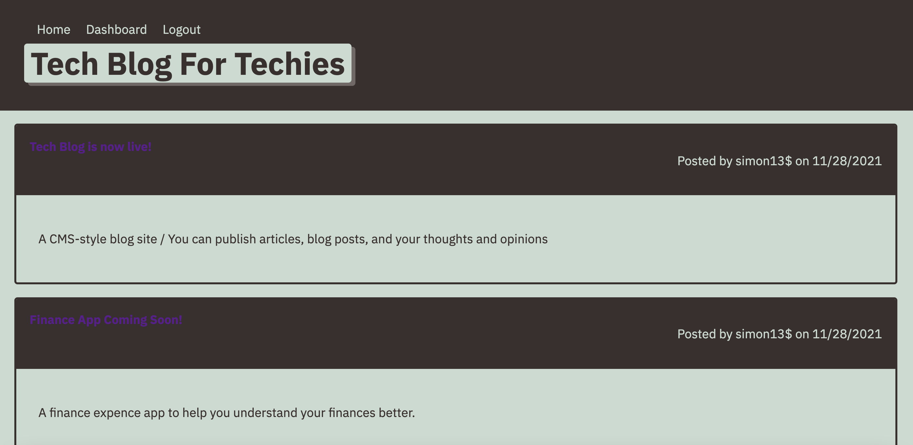

# Tech Blog MVC App
[]

## Description: 
A CMS-style blog site, similar to a wordpress site. Developers can publish their blog posts and comment on other developer's posts as well. This site was built from scratch and uses the MVC paradigm in its architectural structure.

## Installation:
1. Clone repository: git@github.com:LunaZ13/tech-blog-MVC.git
2. Run `mysql -u root -p` 
3. Enter password from .env file.
4. Run `source db/schema.sql` to create the database, then `quit`.
5. Run `node server.js` to connect to server.

## Usage:
User is able to sign up by creating a username and password. Then user can log in and log out, user can can also click on dashboard link. User is able to create new blog posts, edit posts, and delete posts when logged in. User can also comment on posts created by other users.
Click on the following link to view site https://morning-oasis-23318.herokuapp.com/

## Contributing:
Feel free to fork project and reach out.

## Built With:
* HTML
* CSS 
* JavaScript
* Node.js
* Express.js
* Handlebars Js
* dotenv, MySQL2, Sequelize packages
* Heroku

## Credits:
Created by Inmar Luna :grinning:

## License 

Copyright (c) [2021] [Inmar Luna]

Permission is hereby granted, free of charge, to any person obtaining a copy
of this software and associated documentation files (the "Software"), to deal
in the Software without restriction, including without limitation the rights
to use, copy, modify, merge, publish, distribute, sublicense, and/or sell
copies of the Software, and to permit persons to whom the Software is